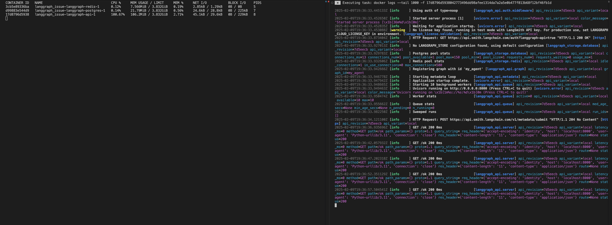

# LangGraph Docker 100 CPU Issue
Based on manuals:
- https://langchain-ai.github.io/langgraph/how-tos/deploy-self-hosted/#using-docker
- https://langchain-ai.github.io/langgraph/tutorials/introduction/#part-1-build-a-basic-chatbot

What I did:
```
python3.11 -m venv .venv
```
```
source .venv/bin/activate
```
```
python3 --version
Python 3.11.11
```
```
pip install -U langgraph-cli
```
```
langgraph build -t my-image
```
```
docker compose up -d
```

